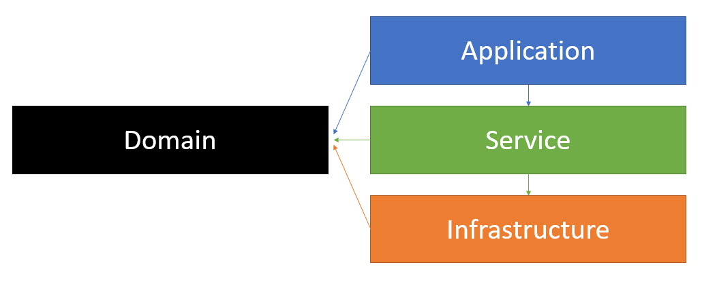

## Introduction

First of all, as you must know, DDD is not an architecture. DDD (Domain Driven Design) is a software modeling whose objective is to facilitate the implementation of complex rules and processes, where it aims to divide responsibilities by layers and is independent of the technology used. Knowing this concept, I present an architecture that can be used as a basis for building an API (Application Programming Interface) using .NET Core 3.1.

## The Architeture

- Application layer: where API controllers will be developed. It has the function of receiving all requests and directing them to a service to perform a certain action.
- Background: responsible for the background jobs and processing, where you can program tasks to execute in a time interval or even integrate with a message-broker.
- Domain layer: This layer is the basis of the entire DDD-based project. This is where we need to properly define our business model in terms of classes, and all the key logic and business rules lies in the domain layer.
- Infrastructure layer: divided into three sub-layers
    - Data: performs the persistence with the database.
    - Cross-Cutting: a separate layer that does not obey the layer hierarchy. As its name says, this layer crosses the entire hierarchy. It contains the functionalities that can be used in any part of the code, such as documents validation, consumption of external API and use of some security.
    - Logging: responsible to make logs to the application.
- Service layer: responsible for orchestrating calls to the domain layer, where it is possible to make some validations and request data from repositories to return to the application layer.

## Generic Classes

I implemented generic classes to streamline the project's development process. Therefore, you can change which are the basic properties of your application and choose whether or not to extend the generic classes that will assist in making the application's CRUDs

## Requirements

To compile the solution, SDK 3.1 must be installed on the machine. If you don't have it yet, [download .NET Core 3.1](https://dotnet.microsoft.com/download/dotnet-core/3.1)

## Database

In this project I am using MySQL. Therefore, to run the project in your local environment, it is necessary to have installed some version of MySQL, which you can find on the page: [MySQL Community Downloads](https://dev.mysql.com/downloads/). You dont need to run any script or migrate to run this project, the database will be created when you run it.

## Background Service

No jobs have actually been implemented in the background (yet), but I've chosen [Quartz](https://github.com/quartznet/quartznet) for scheduling jobs. Quartz it's an old staple of many ASP.NET developers, used as a way of running background tasks on a timer, in a reliable, clustered, way.

## Unit Tests

Unit tests were created with [xUnit](https://xunit.net/) for the service and data access (infrastructure) layers. All the tests created are in the same project, and this choice was based on the fact that there are few classes to be tested, but you can separate the tests into more projects for each layer according to the size of your project and your preference. To facilitate their identification, the layers are separated into folders in the test project.

For the service tests I've used [Moq](https://www.nuget.org/packages/Moq/) for mocking repositories and [Bogus](https://github.com/bchavez/Bogus) to generate fake data. For the repositories tests I've used [EF Core In-Memory Database Provider](https://docs.microsoft.com/en-us/ef/core/providers/in-memory/?tabs=dotnet-core-cli) , that allows Entity Framework Core to be used with an in-memory database.

## How to run the application

1. Set your connection string (in *appsettings.json*)
2. Run!

## Testing the Application

It is possible to test the APIs through Postman. I left a collection and an environment, that you can import and test the requests individually, and make your own tests. If you are not familiar with Postman, you can find a complete guide at: [Postman Documentation](https://learning.postman.com/docs/postman/launching-postman/introduction/)

You will find the files in:

- sample-net-core-ddd\Postman
